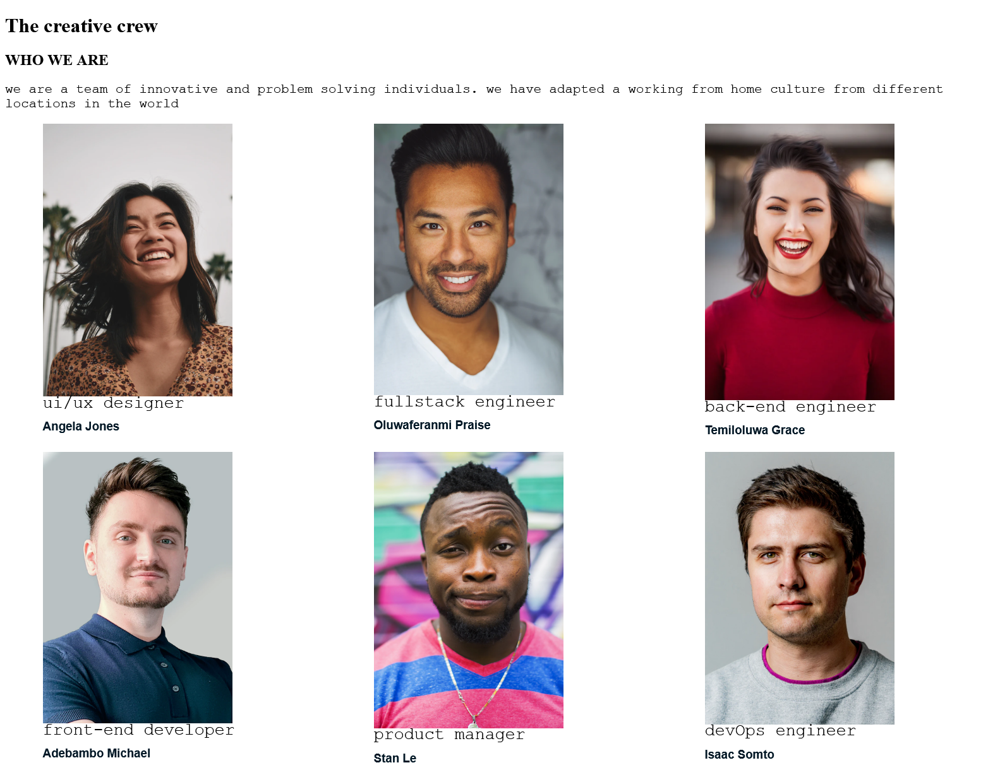

<!-- Please update value in the {}  -->

<h1 align="center">{my-team-page-master}</h1>

   Solution for a challenge from  <a href="http://devchallenges.io" target="_blank">Devchallenges.io</a>.

  <h3>
    <a href="https://{your-demo-link.your-domain}">
      Demo
    </a>
     | 
    <a href="https://{your-url-to-the-solution}">
      Solution
    </a>
     | 
    <a href="https://devchallenges.io/challenges/hhmesazsqgKXrTkYkt0U">
      Challenge
    </a>
  </h3>

<!-- TABLE OF CONTENTS -->

## Table of Contents

- [Overview](#overview)
  - [Built With](#built-with)
- [Features](#features)
- [Contact](#contact)
- [Acknowledgements](#acknowledgements)

<!-- OVERVIEW -->

## Overview

- you can see my demo at { demo link}

- When building this project i learnt a lot about CSS grid. i also learnt how to stryture problems the right way in order to get answers.

- I leaernt abou some rules in css like(auto-fit and positioning)

  while i improved my knowledge on responsive design and css grid.

-  learning to code offers so many benefits... you get to learn a lot and solve problems.

### Built With

- HTML and CSS

## Features

<!-- List the features of your application or follow the template. Don't share the figma file here :) -->

This application/site was created as a submission to a [DevChallenges](https://devchallenges.io/challenges) challenge. The [challenge](https://devchallenges.io/challenges/hhmesazsqgKXrTkYkt0U) was to build an application to complete the given user stories.

## Acknowledgements

<!-- This section should list any articles or add-ons/plugins that helps you to complete the project. This is optional but it will help you in the future. For exmpale -->

- [CSS Wand](www.csswand.com)
- [W3schools](www,w3schools.com)
- [Marked - a markdown parser](https://github.com/chjj/marked)

## Contact

- Website [your-website.com](https://{your-web-site-link})

- GitHub [@Mikeoxygen](https://{github.com/Mikeoxygen})

- Twitter [@Mikeoxygen](https://{twitter.com/Mikeoxygen1})
